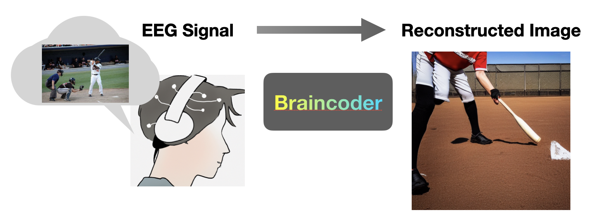
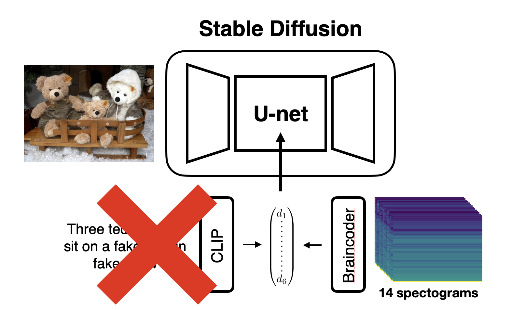
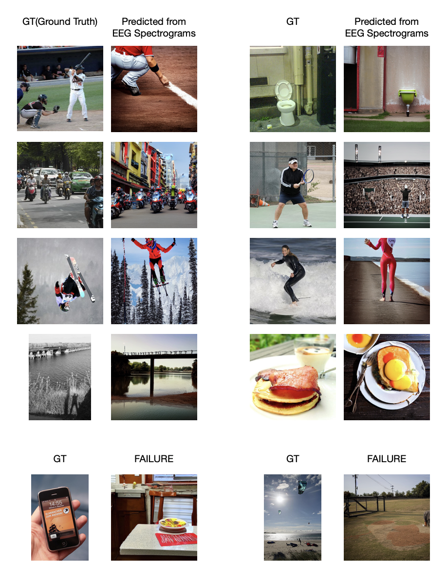

# Braincoder: Using Image Encoder's Ability to reconstruct visual stimuli from Brain EEG Signals Spectrogram.

## Braincoder

We suggest new approach to reconstruct the visual stimuli from Brain EEG Signals. Recent researchs keep focus on reconstructing using EEG or MEG with time series format, for example [META's research](https://ai.meta.com/static-resource/image-decoding). Although it seems like impossible that reconstructing visual stimuli from ugly 14 spectograms, we show that this can be possible to some extent.

## Overview

The main idea of this research is that using an Image Encoder can be another sort of solution for analyzing EEG data. First, to get a high-quality caption, we select the [MS COCO 2014](https://cocodataset.org/#home) and select different image domains within it. After selection, our researchers participated in the experiment, gazing at selected photos with EEG equipment. We chose [CoAtNet](https://arxiv.org/abs/2106.04803) as the baseline architecture for encoding the EEG spectrograms into CLIP vectors. The main objective of the training is that CoAtNet vector space is to be aligned with the CLIP vector space, so we use L2 loss and cosine similarity loss for approximate CLIP vector space. If training is successful, we can visualize the visual stimuli using Braincoder's encoded vector on stable diffusion's cross attention, instead of CLIP vector. No further stable diffusion fine-tuning was executed as we have limited computing power, cause I'm a high school student. However, even with several failures, we get wonderful results. Our experiment will be ongoing to test whether it may work well on another person's EEG data with a transfer learning. Please support our research!! Thanks.

## Results

<!--  -->

This animation show generated image development during training step from 14 EEG spectograms captured on gazing baseball playing image.

## Acknowledge

The model code built based on [CoAtNet Implementation](https://github.com/chinhsuanwu/coatnet-pytorch).

## Citation

Please cite the following github repositories.

